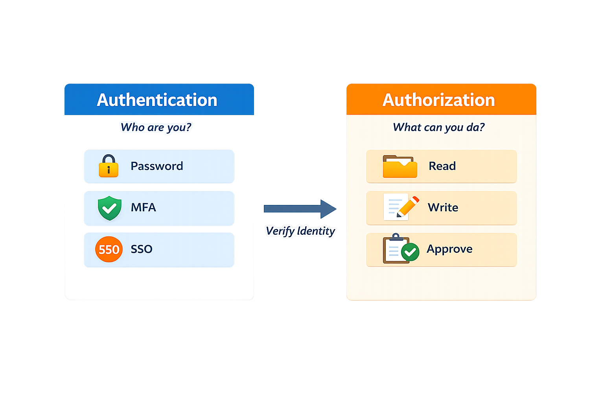

# Identity and Access Management (IAM)

Identity and Access Management (IAM) focuses on controlling who has access to systems, applications, and data, and ensuring that access is appropriate based on a user's role and responsibilities.

In practice, IAM is one of the most important areas of security. Many security issues are not caused by attackers breaking in, but by users having too much access, outdated permissions, or access that was never removed.

---

## Purpose

IAM helps organizations:

* Control access to systems and data
* Enforce least privilege
* Manage user access throughout its lifecycle
* Reduce risk related to excessive or unused access
* Support auditing and compliance efforts

Without proper IAM, it becomes difficult to answer basic questions such as:

* Who has access to what?
* Why do they have it?
* Should they still have it?

---

## Core Concepts

### Identity

An identity represents a user or system within an environment.

Examples include:

* Employees
* Contractors
* Service accounts
* Applications

Each identity should be uniquely identifiable and tied to a specific purpose.

### Authentication

Authentication verifies who a user is.

Common methods include:

* Passwords
* Multi-factor authentication (MFA)
* Single sign-on (SSO)

The goal is to ensure users are who they claim to be.

### Authorization

Authorization determines what a user is allowed to do after authentication.

This includes:

* Access to systems
* Permissions within applications
* Ability to perform specific actions

Authorization should always align with business needs and job responsibilities.

---

## Access Control Principles

### Least Privilege

Users should only have the minimum level of access required to perform their job.

This helps reduce:

* Risk of misuse
* Impact of compromised accounts
* Exposure of sensitive data

### Segregation of Duties (SoD)

Critical tasks should be divided across multiple users to reduce the risk of abuse, fraud, or error.

For example:

* One user creates a transaction
* Another user approves it

This improves accountability and reduces risk.

### Role-Based Access Control (RBAC)

RBAC assigns access based on roles rather than individual users.

Benefits include:

* Easier access management
* Greater consistency
* Reduced administrative complexity

---

## User Lifecycle Management

Access should not be static. It must be managed throughout the user lifecycle.

This is often described as:

* **Joiner** – A new user receives appropriate access
* **Mover** – Access is adjusted when responsibilities change
* **Leaver** – Access is removed when a user leaves the organization

Failures in this process are a common source of security risk.

---

## Common IAM Risks

Some of the most common IAM challenges include:

* Excessive permissions
* Inactive or dormant accounts
* Privileged access without appropriate controls
* Lack of visibility into user access
* Delayed access removal

These issues frequently appear during audits, access reviews, and security assessments.

---

## Practical Considerations

IAM is not just about assigning permissions. It is about maintaining control over access over time.

In real environments:

* Access changes frequently
* Systems are interconnected
* Manual processes introduce errors
* Business needs continue to evolve

The goal is to keep access accurate, controlled, and aligned with organizational needs.

Strong IAM programs focus on ensuring users have the right access at the right time—and only for as long as they need it.

---

## Summary

IAM plays a central role in protecting systems and data by ensuring users have the appropriate level of access throughout their lifecycle.

When implemented effectively, IAM improves security, supports compliance efforts, and reduces the risk of unauthorized access, misuse, or excessive permissions.
